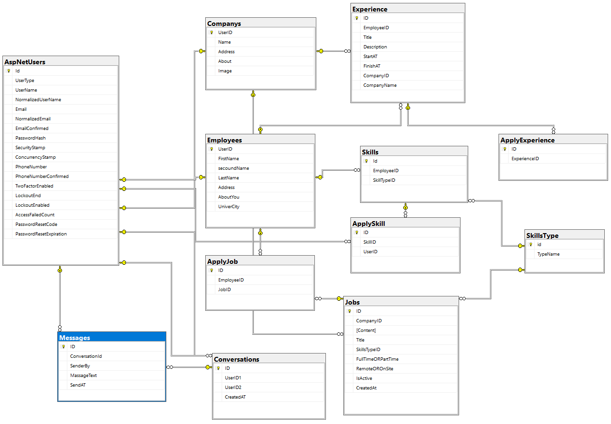

# Employment System API

An advanced employment management system built with ASP.NET Core Web API.  
The system allows companies to post job vacancies, users to apply for jobs, and provides a full messaging system between users, in addition to skill and experience validation features.

---

## 📌 Features

- 🔐 User registration and authentication (JWT)
- 🧑‍💼 Company & Employee management
- 📄 Job posting by companies
- 📝 Apply to jobs by users
- 💬 chat/messages between users
- 🧠 User skills & experiences with confirmation
- 🔍 Search & filter companies and users
- 📑 Role-based access for Company and Employee
- 🗃️ Clean and structured API with 26 endpoints

---

## ⚙️ Tech Stack

- ASP.NET Core Web API (.NET 7)
- Entity Framework Core
- SQL Server
- JWT Authentication
- LINQ & Filtering
- Service Layer Pattern for clean architecture

---

## 🖼️ Database Diagram



---

## 🚀 Getting Started

### 1. Clone the repository
```bash
git clone https://github.com/hadi-dotnet/EmploymentSystem.API.git
```

### 2. Navigate to the project folder
```bash
cd EmploymentSystem.API
```

### 3. Setup the database
- Create SQL Server DB
- Add connection string to `appsettings.json`
- Run migrations:
```bash
dotnet ef database update
```

### 4. Run the API
```bash
dotnet run
```

The API will start at: `https://localhost:5001`

---

## 🧪 API Testing

> ✅ Swagger is available at: `https://localhost:5001/swagger`  
> ⏳ Postman collection coming soon  

For now, you can use Swagger to explore and test all endpoints,  
or use Postman manually with Bearer token authentication.

---

## 📂 Folder Structure

```
├── Job.API/                  # Web API project (Controllers, Program.cs)
│   └── Controllers/
├── Job.Core/                 # Core domain (Entities, Enums)
│   └── Entities/
├── Job.Infrastructure/       # Persistence (DbContext, Migrations)
│   └── Context/
│   └── Migrations/
├── Job.Services/             # Business logic (Services, DTOs, Interfaces, Results)
│   ├── Services/
│   ├── DTOs/
│   └── Interfaces/         
└── README.md
```

---

## 🙌 Author

Using ChatGPT to learn and explore new concepts.
Built with love by [Hadi](https://github.com/hadi-dotnet) ❤️
