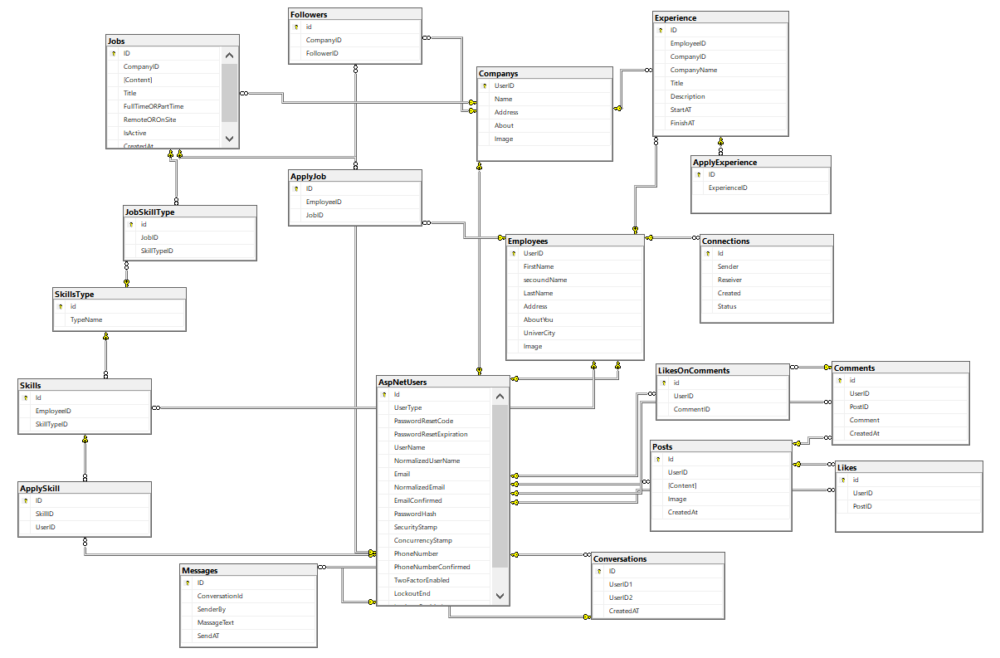

# Employment System API

An advanced employment management system built with ASP.NET Core Web API, featuring 53 APIs. The system allows companies to post job vacancies, users to apply for jobs, and provides a full messaging system between users, in addition to skill and experience validation features. It also includes a professional social layer with features such as company following, user connections (similar to LinkedIn), and a posts system that supports likes and comments.

---

## 📌 Features

- 🔐 User registration and authentication (JWT)
- 📧 Email confirmation and password reset
- 🧑‍💼 Company & Employee management
- 📄 Job posting by companies
- 📝 Apply to jobs by users
- 💬 Chat and messaging between users
- 🧠 User skills & experiences with confirmation
- 🔍 Search and filter companies and users
- 📑 Role-based access for Company and Employee
- 🤝 User connections (like LinkedIn)
- 🏢 Follow companies
- 📰 Posts system with likes and comments
- 🗃️ Clean and well-structured API with 53 endpoints

---

## ⚙️ Tech Stack

- ASP.NET Core Web API (.NET 7)
- Entity Framework Core
- SQL Server
- JWT Authentication
- LINQ & Filtering
- Service Layer Pattern for clean architecture
- Async/Await for better performance
- Dependency Injection

---

## 🖼️ Database Diagram



---

## 🚀 Getting Started

### 1. Clone the repository
```bash
git clone https://github.com/hadi-dotnet/EmploymentSystem.API.git
```

### 2. Navigate to the project folder
```bash
cd EmploymentSystem.API
```

### 3. Setup the database
- Create SQL Server DB
- Add connection string to `appsettings.json`
- Run migrations:
```bash
dotnet ef database update
```

### 4. Run the API
```bash
dotnet run
```

The API will start at: `https://localhost:5001`

---

## 🧪 API Testing

> ✅ Swagger is available at: `https://localhost:5001/swagger`  
> ⏳ Postman collection coming soon  

For now, you can use Swagger to explore and test all endpoints,  
or use Postman manually with Bearer token authentication.

---

## 📧 Email Settings for Testing
```
"Smtp": {
  "Host": "your-smtp-host",
  "Port": 587,
  "UseSsl": true,
  "From": "your-email@example.com",
  "User": "your-smtp-username",
  "Password": "your-smtp-password"
}
```
To test email confirmation and password reset features, replace the above values with your own SMTP account (e.g., Mailtrap for testing or your SMTP provider). This ensures emails are sent correctly

---

## 📂 Folder Structure

```
├── Job.API/                  # Web API project (Controllers, Program.cs)
│   └── Controllers/
├── Job.Core/                 # Core domain (Entities, Enums)
│   └── Entities/
├── Job.Infrastructure/       # Persistence (DbContext, Migrations)
│   └── Context/
│   └── Migrations/
├── Job.Services/             # Business logic (Services, DTOs, Interfaces, Results)
│   ├── Services/
│   ├── DTOs/
│   └── Interfaces/         
└── README.md
```

---

## 🙌 Author

Using ChatGPT to learn and explore new concepts.
Built with love by [Hadi](https://github.com/hadi-dotnet) ❤️
linkedin : [Hadi-Aboshah](https://www.linkedin.com/in/hadi-aboshah/)
